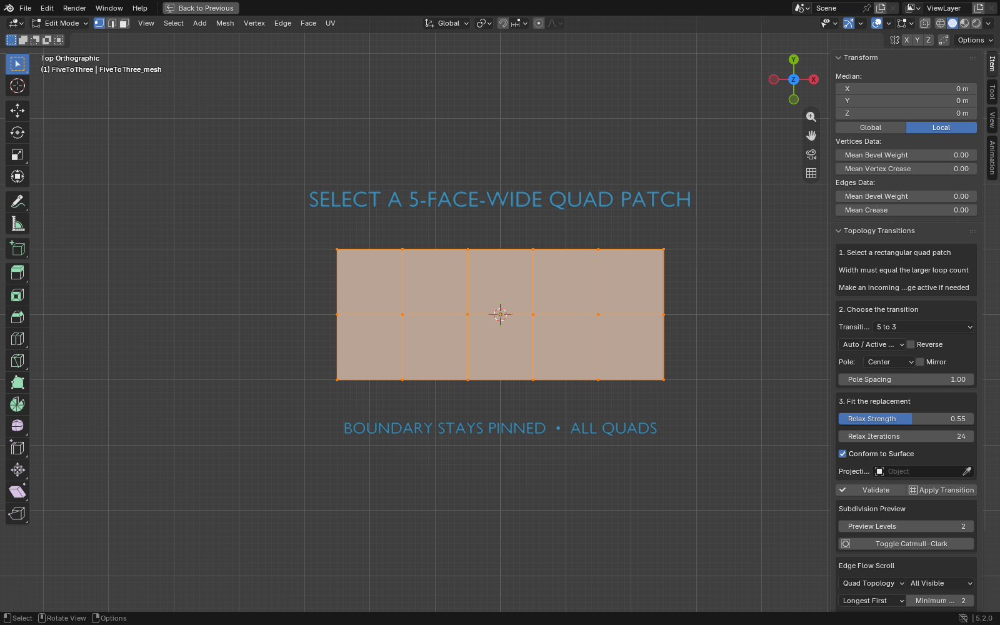
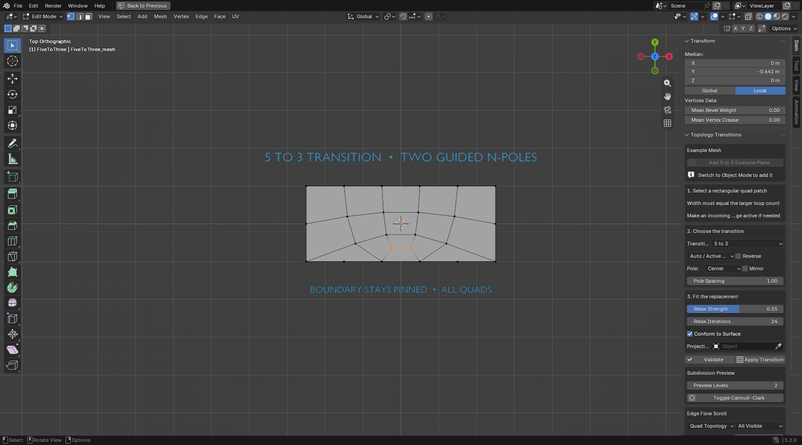
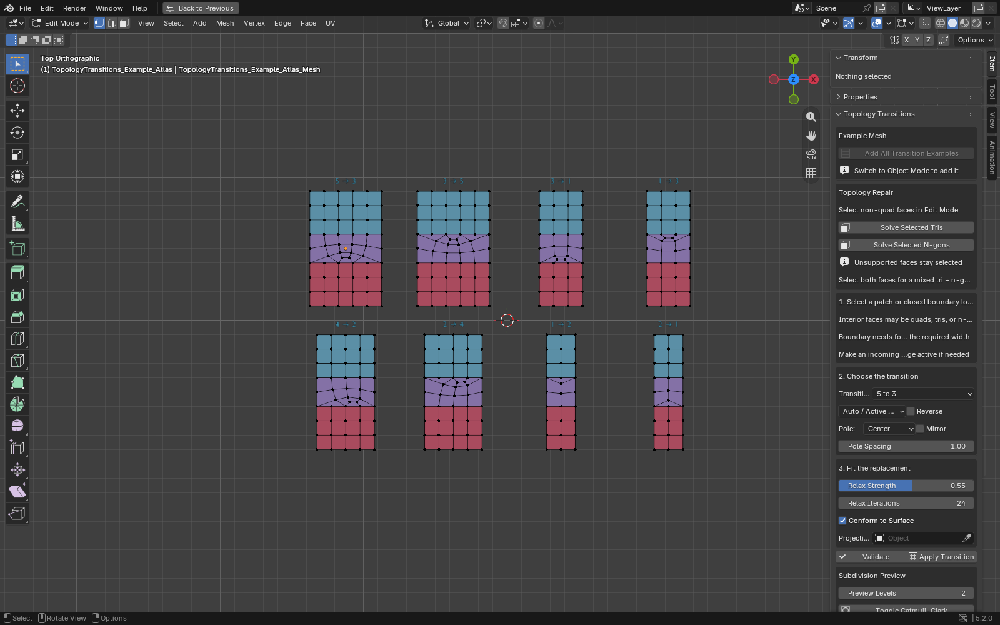
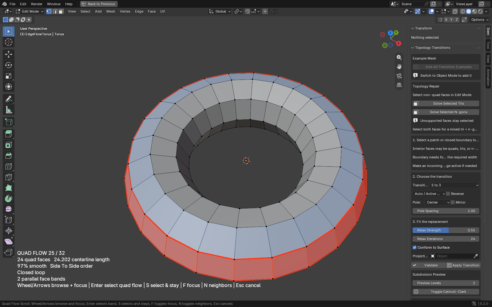
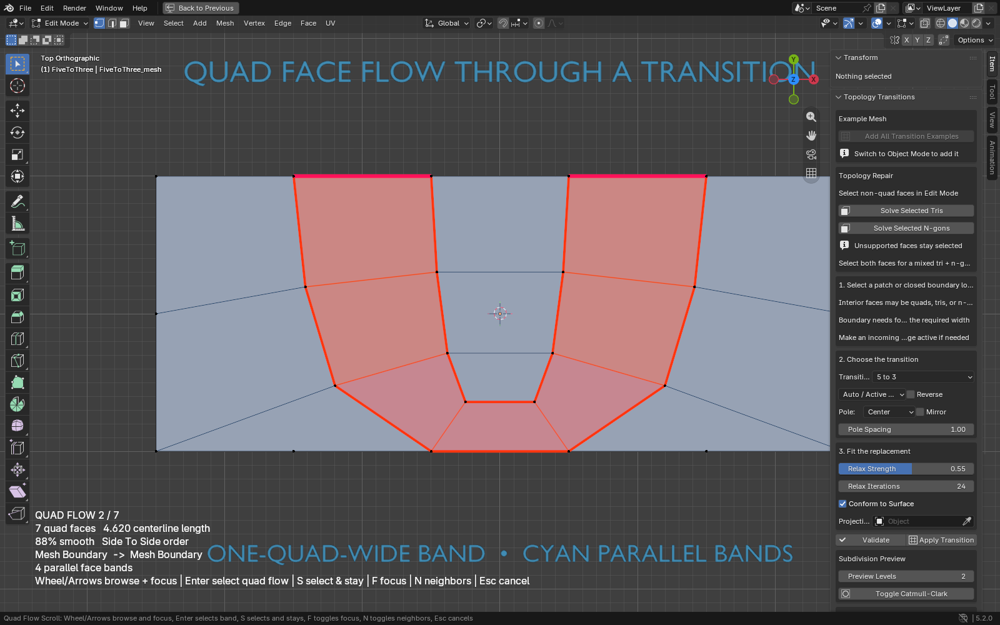

# Topology Transitions

Topology Transitions is a Blender add-on for rebuilding a rectangular mesh region with a guided edge-loop reduction or expansion, repairing selected triangles and n-gons when a safe all-quad solution exists, and browsing the actual one-quad-wide face flows through the result. It automates deterministic connectivity while leaving the artistic decision—where the poles belong—under your control.

It supports:

- 5 ↔ 3
- 3 ↔ 1
- 4 ↔ 2
- 1 ↔ 2
- left, center, and right pole placement where the pattern permits it
- mirror and reverse-flow controls
- pinned outside boundaries
- surface conformity to the original patch or another mesh
- pinned-boundary relaxation
- non-destructive Catmull-Clark preview
- validation before mutation and rollback on apply-time failure
- mixed quad/triangle/n-gon patch interiors and closed selected-edge boundaries
- separate **Solve Selected Tris** and **Solve Selected N-gons** repair actions
- a wheel-driven quad-face-flow inspector with side-to-side ordering, full face-band highlighting, automatic view focus, metrics, and endpoints
- one labeled colored atlas containing all eight supported transition directions

The operator never silently inserts triangles or n-gons.

## What it does

Select a rectangular face patch whose width matches the larger loop count, or select its closed outside edge loop. Its interior may already contain quads, triangles, or n-gons; Apply Transition replaces the entire interior from the preserved boundary.



Applying the 5 to 3 pattern replaces only the selected interior, keeps its outside boundary pinned, and creates two guided N-poles without triangles or n-gons.



## Install

1. Download the release ZIP from the GitHub Releases page.
2. In Blender 4.2 or newer, open **Edit → Preferences → Get Extensions**.
3. Use the menu in the top-right corner and choose **Install from Disk**.
4. Select `topology-transitions-<version>.zip` and enable **Topology Transitions**.

The panel appears in **3D View → Sidebar → Quad Transition**.

## Transition example atlas

In Object Mode, choose **Add All Transition Examples** at the top of the panel. The add-on creates one joined all-quad atlas at the 3D Cursor with labeled tiles for 5 → 3, 3 → 5, 3 → 1, 1 → 3, 4 → 2, 2 → 4, 1 → 2, and 2 → 1. Enter Edit Mode and start Quad Flow Scroll to explore every tile.



## Workflow

1. Enter Edit Mode and select one connected rectangular face region, or select one closed boundary edge loop around it.
2. Make the strip as wide as the larger loop count. A 5 → 3 transition therefore needs a five-face-wide selection; its height determines how much room the transition has.
3. If direction matters, make an edge on the incoming boundary active. Use **Reverse Flow** to swap to the opposite boundary.
4. Choose the transition and pole controls in the **Quad Transition** panel.
5. Run **Validate**. This checks connectivity, parity, four-sided boundary shape, and the generated quad graph without changing the mesh.
6. Run **Apply Transition**. The outside boundary remains pinned and the new interior is relaxed and optionally projected.
7. Toggle the Catmull-Clark preview to inspect the subdivided flow.

Blender's **Adjust Last Operation** panel can be used immediately after applying a transition. Normal Blender Undo is also supported.

## Topology repair

The **Topology Repair** box has two deliberately separate actions:

- **Solve Selected Tris** first pairs adjacent selected triangles, then tries a selected triangle plus selected odd n-gon as one even-boundary region, then uses a three-quad center grid for an isolated mesh-boundary triangle.
- **Solve Selected N-gons** partitions clean even n-gons into convex quad fans, tries a selected odd n-gon plus selected triangle as one even-boundary region, then uses a center grid for an isolated odd mesh-boundary n-gon.

Both actions preserve the outside boundary, reject non-manifold or geometrically invalid candidates, and roll back unexpected failures. Select both faces when using a mixed triangle + odd n-gon repair. If only some selected targets can be solved, the unsupported faces remain selected for the next modeling decision.

An isolated manifold triangle or odd n-gon cannot become an all-quad disk without changing a neighboring boundary. The add-on reports that constraint instead of creating a collinear fake quad or silently modifying an unselected face.

## Quad Flow Scroll

In Edit Mode, open **Quad Flow Scroll** and choose **Start Quad Flow Inspector**. The modal inspector discovers face bands across the active mesh and lets you browse them without changing the current selection until you confirm.



- **Translucent orange faces** are the flow itself: one maximal, one-quad-wide face band reached by entering each quad through one edge and leaving through its opposite edge.
- **Orange outlines** show the band boundary and its internal quad divisions; there is no longer a center edge chain pretending to be the flow.
- **Cyan faces** are directly adjacent parallel face bands, not perpendicular flows that happen to share a face.
- **Magenta terminal edges** mark mesh, selection-scope, non-quad, or non-manifold boundaries.
- **Mouse wheel / arrow keys** browse and automatically frame each strip; **Home / End** jump to the first or last flow.
- **Enter** selects the full quad strip and exits; **S** selects it and keeps browsing.
- **F** toggles automatic view focus; **N** toggles parallel neighbors; **Esc / right-click** restores the original selection.

Each quad participates in two perpendicular face flows. Continuation crosses the opposite edge of the current quad, so it is topology-driven and does not guess from vertex valence or pose. Use **All Visible** to inspect the full mesh or **Selected Faces** to isolate a region. The default **Side to Side** order finishes one adjacent parallel family before changing orientation or disconnected component; length, smoothness, and stable face-index orders remain available.



The HUD and sidebar report the flow number, quad count, world-space centerline length, smoothness, closed/open state, endpoint classifications, and parallel-band count. See [docs/EDGE_FLOW_SCROLL.md](docs/EDGE_FLOW_SCROLL.md) for the discovery rules and control reference.

## Selection contract

The selected patch must be:

- one connected disk with no holes;
- bounded by one loop with four sides and four detectable corners;
- as wide as `max(incoming loops, outgoing loops)`;
- free of branching and non-manifold edges.

Its interior may mix quads, triangles, and n-gons. A closed selected edge loop can define the region without selecting its faces; when both sides of a loop are bounded on a closed mesh, the smaller enclosed face island is used. Mixed-topology boundaries use the four strongest geometric turns as corners, so the boundary still needs a clear rectangular shape. Outside faces are preserved, and every boundary edge retains its original face count after replacement.

For 1 ↔ 2, quad parity requires one compensating edge on a side boundary. **Pole Side** and **Mirror** choose which side carries that shoulder.

## Controls

| Control | Effect |
| --- | --- |
| Transition | Incoming and outgoing loop counts. |
| Patch Axis | Uses the active boundary edge automatically or the alternate valid axis on square selections. |
| Reverse Flow | Swaps the incoming and outgoing sides of the selected rectangle. |
| Pole Side | Positions the local reduction cell left, center, or right where the width allows. |
| Mirror | Mirrors the pole slot or the asymmetric 1 ↔ 2 shoulder. |
| Pole Spacing | Adjusts the initial spacing of the valence-three poles before relaxation. |
| Relax Strength / Iterations | Smooths new interior vertices while boundary vertices remain pinned. |
| Conform to Surface | Projects new vertices onto the original selected surface. |
| Projection Target | Uses another mesh instead of the original patch for nearest-surface projection. |
| Preview Levels | Sets the viewport level of the add-on's Catmull-Clark modifier. |

### Quad-flow controls

| Control | Effect |
| --- | --- |
| Scope | Discovers face flows across all visible faces or only selected faces. |
| Order | Traverses side-to-side by default, or sorts by quad count, smoothness, or stable face index. |
| Minimum Quads | Hides short face bands. |
| Focus View | Centers and frames the active face band whenever the browser advances. |
| Show Neighbors | Fills directly adjacent parallel face bands in cyan. |
| Previous / Refresh / Next | Steps through flows without entering the modal wheel inspector. |

## Safety and guarantees

For every accepted operation, the add-on checks:

- all generated faces are quads;
- the template is one connected disk with Euler characteristic 1;
- generated edges have at most two linked faces;
- expected N-poles have valence three;
- the outside boundary coordinates and face counts are unchanged;
- no generated quad has zero area.

Meshes with shape keys are rejected rather than modified because interpolating new vertices across every key is not unambiguous.

## Current limitations

- Apply Transition still needs a four-sided boundary with compatible opposite side counts. It does not infer an arbitrary transition region from one loose edge chain or choose pole locations across an entire model.
- Geometric corner inference for mixed-topology or edge-loop-defined patches expects four visibly stronger turns; heavily curved, equally segmented boundaries may need a cleaner rectangular selection.
- The repair buttons are conservative local solvers, not a global retopologizer. Unsupported manifold odd boundaries stay selected because solving them would require expanding into neighboring faces.
- New loops receive default per-loop custom-data values. Material index and smooth shading are preserved, but UVs, custom normals, color attributes, creases, and similar loop/edge data may need to be rebuilt on the replaced patch.
- Nearest-surface projection can choose the wrong sheet on tightly overlapping geometry. Use an explicit projection target or disable conformity in that situation.
- Compound reductions such as 9 → 5 are not yet chained automatically.
- Multi-object Edit Mode is rejected; edit one mesh data-block at a time.
- Quad Flow Scroll stops at mesh boundaries, scope boundaries, non-quad faces, and non-manifold edges. Each quad belongs to two perpendicular flows by design.

## Development

Pure topology tests:

```powershell
python -m unittest discover -s tests -v
python -m compileall topology_transitions tests scripts
```

Headless Blender smoke:

```powershell
blender.exe --background --factory-startup --python tests\blender_smoke.py
```

Recreate the documentation screenshots in a normal Blender window:

```powershell
blender.exe --factory-startup --python scripts\capture_docs.py -- --shot flow
```

Valid shot names are `before`, `after`, `flow`, `pole`, and `example`. The originals are saved to the Windows **Pictures\Screenshots** folder before curated copies are added to `docs/images`.

Build the installable ZIP:

```powershell
python scripts\build_release.py
```

The smoke requires the explicit marker `QT_BLENDER_SMOKE_PASS`; a zero process exit by itself is not treated as proof.

## Architecture

- `topology_transitions/core.py` builds and validates Blender-independent quad graphs.
- `topology_transitions/mesh_ops.py` validates and partitions Edit Mode selections.
- `topology_transitions/operators.py` fits, projects, applies, verifies, and rolls back BMesh changes.
- `topology_transitions/quad_repair.py` plans clean convex quad fans without Blender dependencies.
- `topology_transitions/repair_ops.py` applies transactional triangle and n-gon repairs.
- `topology_transitions/quad_flows.py` discovers and measures mesh-independent face bands.
- `topology_transitions/flow_ops.py` adapts Edit Mode BMesh data and owns the modal viewport overlay.
- `topology_transitions/ui.py` exposes the workflow in the 3D View sidebar.
- `tests/test_core.py` proves graph invariants with standard Python.
- `tests/test_quad_flows.py` proves face-band discovery, scope, perpendicular membership, and side-to-side ordering.
- `tests/test_quad_repair.py` proves parity and geometric fan planning.
- `tests/blender_smoke.py` proves behavior inside Blender.
- `scripts/capture_docs.py` reproducibly creates the real Blender documentation captures.

The topology and parity derivation is documented in [docs/TOPOLOGY.md](docs/TOPOLOGY.md).

## License

MIT. See [LICENSE](LICENSE).
