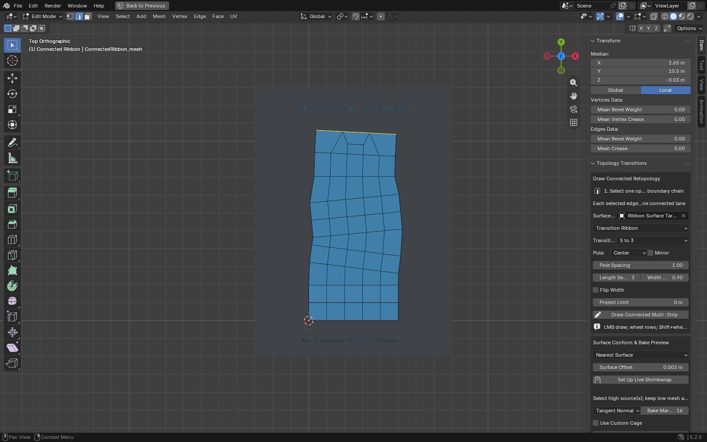
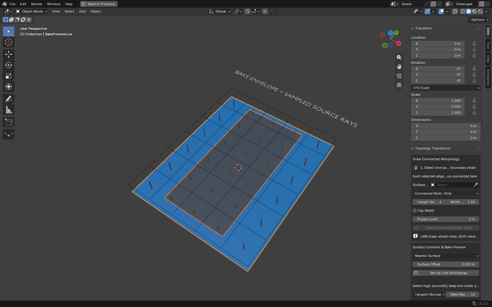

# Connected Multi-Strip, Surface Conformity, and Baking

This workflow grows several quad lanes as one mesh. It is boundary-driven: the
selected open edge chain is the bottom row, every selected edge becomes one
lane, and those exact existing vertices are reused. No duplicate seam is placed
on top of the bottom quads.

## Draw a connected quad sheet

1. Keep the high-resolution source visible as a separate mesh object.
2. Select the low-poly retopology mesh and enter Edit Mode.
3. In edge selection mode, select one connected open boundary chain. Every edge
   must currently have exactly one linked face.
4. Set **Surface Target** and choose either **Connected Multi-Strip** or
   **Transition Ribbon**.
5. Click **Draw Connected Multi-Strip**, then drag LMB over the target.
6. Use the wheel to change longitudinal rows and Shift+wheel to change width.
   Enter commits; Esc or right-click cancels without changing the mesh.

The preview fills the complete proposed quad sheet in cyan. Transition cells
around the generated poles are magenta. On commit, the tool validates nonzero
quad area, manifold edge use, pole valence, every welded anchor edge, and the
far output boundary. That output chain is selected automatically, so another
draw begins where the previous one ended.

**Connected Multi-Strip** accepts any positive number of selected boundary
edges. **Transition Ribbon** uses the add-on's real 5-to-3, 3-to-5, 3-to-1,
1-to-3, 4-to-2, 2-to-4, 1-to-2, or 2-to-1 pole templates. Its selected input
count must match the chosen pattern; the far selected boundary exposes the
declared output count.

The operation rejects interior edges, hidden edges, branched/disconnected or
closed chains, multi-object Edit Mode, shape-key meshes, a self-target, target
projection misses, folded/zero-area quads, and non-manifold results. New loops
use Blender's default custom-data values, so unwrap the new faces and rebuild
any required color attributes, creases, or custom normals.

## How this differs from independent PolyStrips

[RetopoFlow 4 PolyStrips](https://docs.retopoflow.com/v4/polystrips.html) uses a
drawn spline to produce a strip, with brush size, segment count, width, and
curve-handle editing. [RetopoFlow Strokes](https://docs.retopoflow.com/v4/strokes.html)
contains more boundary-aware tools such as Equals Strip and boundary bridging.

Connected Multi-Strip starts from a complete ordered boundary chain. One
surface stroke drives all lanes, shared cross-row vertices keep the result one
connected sheet, and the original boundary vertices form row zero. This is the
specific behavior needed when several bottom quads must continue together
instead of producing side-by-side independent strips.

## Live surface conformity

The drawing operator projects every new vertex directly onto the evaluated
surface target. **Set Up Live Shrinkwrap** then adds or updates one named,
non-destructive modifier for continued editing; repeated clicks do not stack
duplicates. Blender's official
[Shrinkwrap documentation](https://docs.blender.org/manual/en/latest/modeling/modifiers/deform/shrinkwrap.html)
describes the three exposed presets:

| Preset | Practical use |
| --- | --- |
| Nearest Surface | Fast default when the retopology is already close to the source. |
| Target Normal Project | Smoother organic conformity, with higher evaluation cost. |
| Local Z Project | Bidirectional projection along the low object's local Z axis, useful where nearest-point snapping chooses the wrong sheet. |

The modifier is visible in Edit Mode and on the editable cage. A finite Project
Limit can prevent snapping across distant or overlapping shells. Surface Offset
keeps the low mesh slightly above the source. Non-uniform object scale makes a
local offset appear uneven in world space, so the bake readiness check reports
unapplied transforms.

## Bake cage and ray preview

**Toggle Bake Cage** creates an orange, in-front wire copy of the low mesh and
inflates only vertex positions along low-poly normals. It preserves vertex,
edge, polygon, loop, and face ordering. A stored topology/geometry/transform
signature marks the cage stale after later low-poly edits; rebuilding replaces
its mesh without accumulating cage objects.

**Toggle Ray Preview** samples low-poly face centers and draws an approximate
selected-to-active ray diagnostic:

- green line: a selected high-poly source was reached;
- red line: no selected source was reached inside the configured distance or
  custom-cage envelope;
- sidebar status: hit coverage, median distance, and 95th-percentile distance.

With custom-cage mode off, the diagnostic tests both low-poly normal directions
up to Max Ray Distance. With it on, rays travel inward from cage faces toward
their topology-matched low faces. The lines are a preflight visualization, not
a bit-for-bit renderer replacement; the final Cycles bake remains authoritative.

## Selected-to-active readiness

The official [Cycles baking documentation](https://docs.blender.org/manual/en/latest/render/cycles/baking.html)
requires the low-poly mesh to be active, high-poly sources to be selected, and
an image target to be active. **Inspect Readiness** checks:

- an active mesh low-poly object and at least one separate selected high mesh;
- a low-poly UV map;
- an active Image Texture node with an assigned image in each used material;
- empty/zero-area geometry, inconsistent winding, and over-connected edges;
- unapplied, negative, or non-uniform transforms;
- render-disabled high sources; and
- exact custom-cage topology parity when cage mode is enabled.

**Configure Bake** switches the scene to Cycles and prepares selected-to-active
Normal or Displacement settings. Tangent space is used for normal maps. Custom
cage and Max Ray Distance are mutually exclusive. The button deliberately does
not call Blender's bake operator, so it cannot overwrite an image merely by
inspecting or preparing the workflow.

## Research-backed next improvements

The next high-value steps are deliberately separate from what is implemented:

1. End a stroke on a second open boundary and solve direction, reversal, and
   cyclic bridge offset by minimum world-space twist.
2. Accumulate several guide paths in one modal session and commit them
   atomically, reusing shared rails between adjacent ribbons.
3. Add editable curve handles and post-creation row/width adjustment.
4. Derive row spacing from source curvature and the selected boundary's average
   edge width, with symmetry seam clipping.
5. Expand the ray diagnostic to face-area sampling, backface/dual-hit classes,
   cage self-intersection warnings, and a material preview of the baked image.
6. Transfer or interpolate UV, color, crease, and other custom data into newly
   drawn topology instead of initializing those layers with defaults.

RetopoFlow's [change history](https://docs.retopoflow.com/v4/changelist.html)
also identifies practical regression cases for future work: bridge twisting,
non-uniform object scale, drawing across symmetry, projection behavior, and
sharp turns on smooth source strokes.
